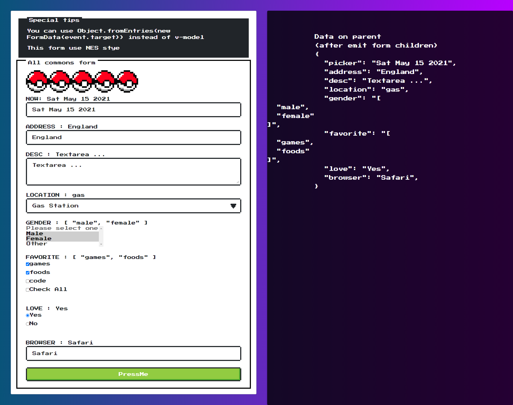

<h1 align="center">Vue 3 form best practice 📑</h1>

<p align="center"></p>

### Getting Started 🚀
npm:
```sh
npm install
npm run dev
npm run build
npm run serve
```
yarn:
```sh
yarn
yarn dev
yarn build
yarn serve
```

### New features of Vue3 uses ✔

- Use `ref & reactive` (ref for `String, Number, Array, Boolean, Symbol` || reactive for `Object`)
- All common form for practice


### New features of vite uses ✔

- Please take a look closely to file `vite.config.js`, its contain some feature options good.
```
// Declare the path "@" instead of "/src"
alias: [{find: "@", replacement: path.resolve(__dirname, '/src')}

// Declare the path of variable source to use variable in style tag in components
css: {
  preprocessorOptions: {
    scss: {
      additionalData: `@import "./src/assets/stylesheets/_variables";` 
    } 
  } 
},

// 

```